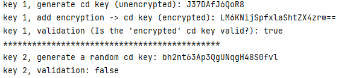

## What

Create a program which generates keys for an application that you may put on a CD. 
Classic example would be the keys you use for installation of a major software product from Microsoft or Adobe.

## General Design

- basic: design a black box containing a series of tests, only specific input/cd-key can pass the test
- medium: encript the cd-key to make the black box harder to decript
- advanced: take the process online and build a database to store all cd-keys
  - advantage: be able to revoke invalid/used keys
  - advantage: be able to bind one key to one user/pc
  - advantage: validation happens on server, instead of local, decreases chances of decripting the system

## Implementation

Generation

- First, I generate a random `11 char string`, then I use a **checksum algorithm** to generate the last char, combined into a `12 char string`.
- This 12 char string is inserted into the **database**.
- Then, I encrypt the 12 char string with **base 64 encryption** and get a `24 char string`. 
- This string is the CD-Key for end user.

Validation

- First, I decrypt the `24 char string` CD-Key, get a `12 char string`.
- Then, I check if this string pass the checksum test.
- Then, I check if this string is valid in the database.
- Only if the above two tests are passed, the CD-Key is recognized as valid.

## Special Run Instruction

- external library needed: `org.apache.commons.codec.binary.Base64`, you can get from here <http://commons.apache.org/proper/commons-codec/download_codec.cgi>

## Reference

- <http://stackoverflow.com/questions/3002067/how-are-software-license-keys-generated>
