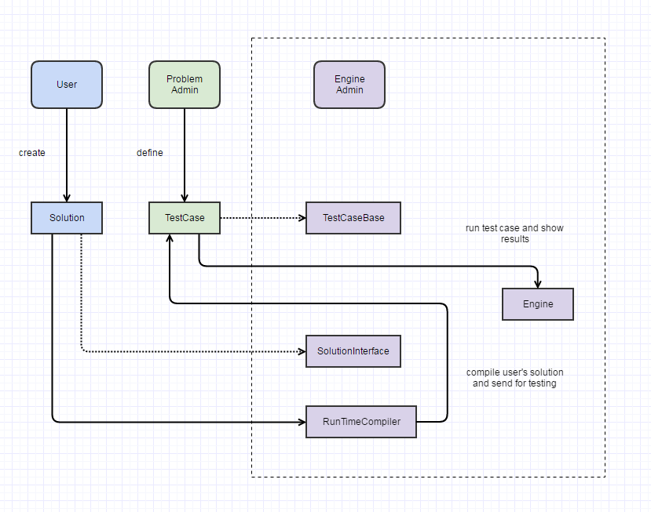

# LeetCodeClone

## What

Design and implement a "Code Problem Test Engine" similar to Leetcode.
- it defines an interface for solving code challenge
- it allows problem admin to create problems and test cases
- it takes user's code as input and shows whether it passes or fails the tests
- it shows error trace message

## Design

