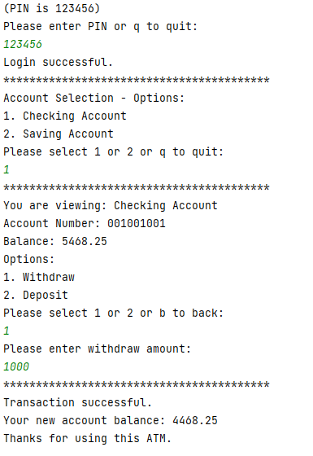
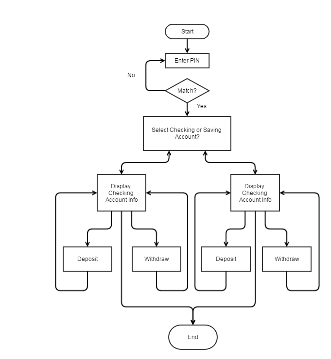
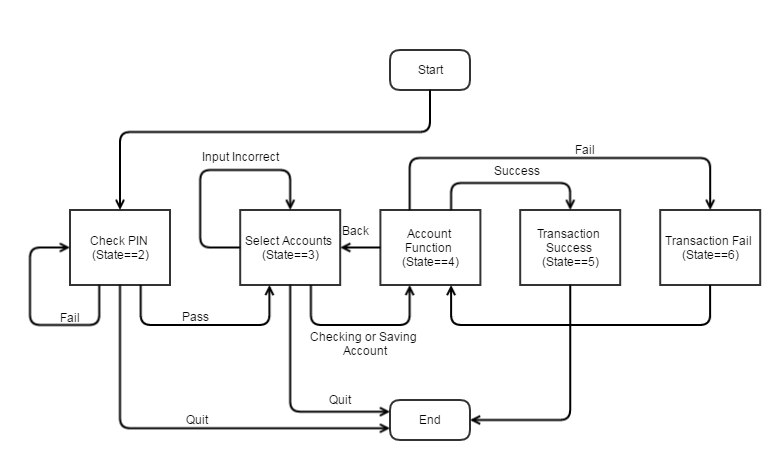
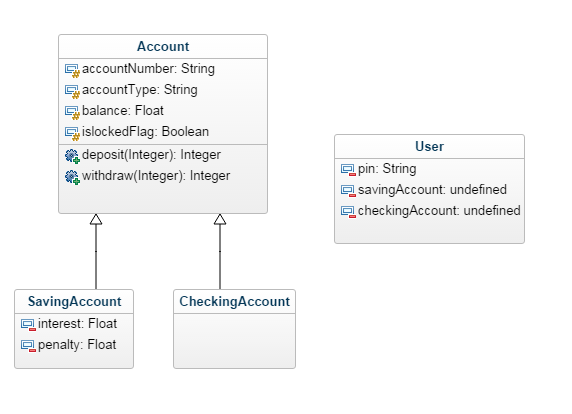

# MiniATM

## What

- Design a program which acts as an ATM machine. 
- The user can specify a PIN and it shows them a menu of their account types (checking and savings). 
- Allow the user to deposit or withdraw money from a selected account type. 
- Be sure to check that they can’t withdraw more money than they have.
- If they deposit more than $10k dollars, it lets the user know it will have to contact the bank manager to clear the deposit and won’t let them then withdraw any of that money.

## Example



## Design

Here I use the [State Pattern](https://en.wikipedia.org/wiki/State_pattern). One pack of state for running the atm, another pack of state for transasction instruction. See below:

State

```
0 - start
1 - end
2 - check pin
3 - select accounts
4 - account function
5 - transaction success
6 - transaction fail
```

Transaction State

```
1 - deposit successful
2 - withdraw successful
3 - deposit maximum alert
4 - account lock
5 - withdraw exceeds balance
```

Flow Chart 1



Flow Chart 2



Class Design



## Run Instruction

Compile and run `Machine.java`